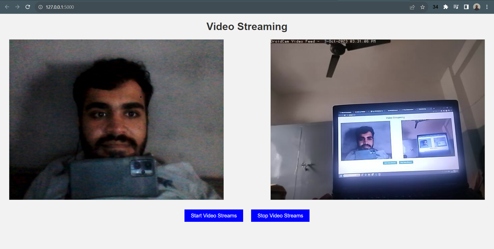

# Flask Video Streaming App README

This README provides an overview and instructions for running the Flask video streaming application you've provided. This application allows you to capture video streams from two different sources: your computer's webcam and an external camera accessible via DroidCam on your mobile device. Users can start and stop video streams and view them through a web interface.

## Prerequisites

Before running the Flask video streaming app, ensure you have the following prerequisites installed:

1. Python 3.x: You can download and install Python from [python.org](https://www.python.org/downloads/).

2. OpenCV (cv2): Install OpenCV using pip:
   ```
   pip install opencv-python
   ```

3. Flask: Install Flask using pip:
   ```
   pip install flask
   ```

## Usage

Follow these steps to run the Flask video streaming application:

1. Clone or download this repository to your local machine.

2. Open a terminal and navigate to the project directory.

3. Run the Flask app by executing the following command:
   ```
   python app.py
   ```

   This will start the Flask app and make it accessible at `http://localhost:5000`.

4. Open a web browser and navigate to `http://localhost:5000`. You will see the web interface of the application.

5. On the web interface, you will find the following options:

   - **Start**: Click the "Start" button to initiate video streams from your computer's webcam and your mobile device's camera via DroidCam.

   - **Stop**: Click the "Stop" button to stop the video streams from both sources.

   - **Camera 1**: This displays the video stream from your computer's webcam.

   - **Camera 2**: This displays the video stream from your mobile device's camera via DroidCam.

6. You can access the video streams individually by opening the following URLs:

   - Webcam Stream: `http://localhost:5000/video_stream1`
   - DroidCam Stream: `http://localhost:5000/video_stream2`

## Adding Screenshot

For reference, here is a screenshot of the Flask video streaming application in action:



## Notes

- The `generate_frames1` function captures video frames from your computer's webcam using OpenCV and streams them to the web interface.

- The `generate_frames2` function captures video frames from your mobile device's camera via DroidCam using OpenCV and streams them to the web interface. Make sure to update the `url` variable with the correct DroidCam IP address and port.

- The Flask app uses the MIME type `multipart/x-mixed-replace` to continuously update and display video frames in real-time on the web interface.

- The app provides a basic HTML interface (`index.html`) for starting and stopping video streams and viewing the streams from both sources.

- You can modify and expand the app as needed, such as adding more camera sources, improving the user interface, or adding additional features.

- Be cautious when accessing the DroidCam stream via a URL, as network stability and camera availability can impact the stream's reliability.

## License

This Flask video streaming application is provided under an open-source license. Please refer to the license file for more details.

---

Feel free to customize and expand upon this Flask video streaming application to meet your specific requirements. If you have any questions or encounter any issues, please refer to the Flask documentation or the OpenCV documentation for further guidance.
